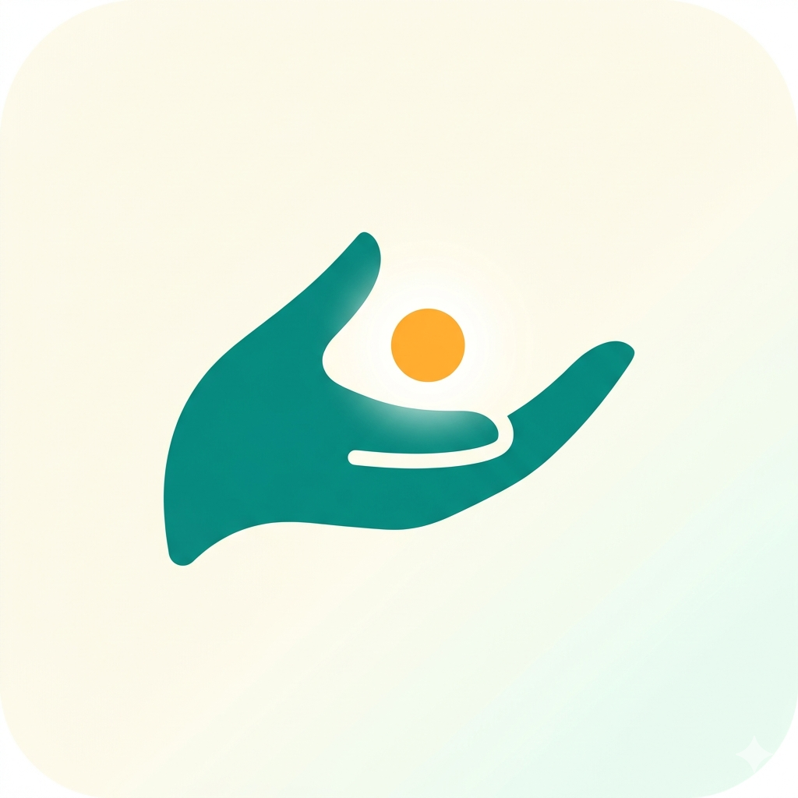

<!--
  Replace [PLACEHOLDER] tokens before submission:
    [YOUTUBE_VIDEO_ID]   — actual YouTube video ID after upload
    [APK_RELEASE_URL]    — actual GitHub Release APK download URL
    [LANDING_PAGE_URL]   — actual landing page URL (GitHub Pages or static host)
-->

<p align="center">
  
</p>

<h1 align="center">MediGemma Field</h1>

<p align="center">
  <b>Frontier healthcare for those beyond the frontier</b><br />
  <i>100 % on-device medical triage AI · 140 languages · works fully offline</i>
</p>

<p align="center">
  <a href="https://www.kaggle.com/competitions/gemma-4-good-hackathon"></a>
  
  
  
</p>

---

## 🎬 Demo

▶ **Watch the 3-minute demo on YouTube**: https://youtu.be/[YOUTUBE_VIDEO_ID]

📦 **Download the Android APK**: [Release v1.0.0]([APK_RELEASE_URL])

🌐 **Live Demo / Landing Page**: [LANDING_PAGE_URL]

---

## What it does

MediGemma Field is an Android app that helps people in remote areas, refugee camps, and conflict zones decide *"should I go to the hospital, or can I manage this at home?"* — entirely on their phone, with no internet, in their own language.

Two entry points:

- **📋 Medical intake form** — tap symptoms, body region, severity, duration; optionally attach a photo
- **💬 Conversational consultation** — speak or type, switch any turn

Either path produces a **WHO ETAT three-level urgency assessment**:

| Level | Meaning |
|---|---|
| 🟦 1 | Manageable at home (with home-care steps) |
| 🟧 2 | See a doctor in 24–72 hours (with specialty + what to bring) |
| 🟥 3 | Go to hospital now (with what to tell the doctor) |

Every result includes an SBAR situation summary, differential conditions, red-flag warning signs, and a clear non-replacement disclaimer.

---

## Why it matters

> **4.5 billion people lack access to basic health services** (WHO 2024).
> **3.1 billion fall in the "Usage Gap"** — coverage exists, but high data costs, expensive devices, or content language gaps keep them effectively offline (GSMA 2025).
>
> The Usage Gap is **10× larger than the Coverage Gap**. In Sub-Saharan Africa alone, **960 million people are connected on paper but offline in practice**.

For these users, a cloud-dependent medical app is unusable at the moment they need it most. MediGemma Field's design is a direct response: a **production-grade triage companion that works without any backend, subscription, or live network connection.**

---

## Architecture: 3-layer progressive enrichment

```
User input (symptoms · text · voice · photo)
        ↓
┌─ Layer 1: ICD-11 dictionary (always, ~ms) ──────┐
│  WHO official taxonomy. No inference.            │
│  Injects medical context into Layer 2 and 3.    │
└──────────────────┬──────────────────────────────┘
                   ↓
┌─ Layer 2: Gemma 4 E2B Standard (always, ~10 s) ─┐
│  enableThinking: false · ICD-grounded prompt.   │
│   ① Confident TRIAGE → return                    │
│   ② FOLLOWUP → next question                     │
│   ③ Unclear → escalate to Layer 3                │
└──────────────────┬──────────────────────────────┘
                   ↓ (escalation only)
┌─ Layer 3: Gemma 4 E2B Thinking (~80 s) ─────────┐
│  enableThinking: true · same ICD context.        │
│  Final triage with internal reasoning.           │
└──────────────────────────────────────────────────┘
```

This is the core of our **Cactus Prize** claim — work routes through *progressive enrichment*: the cheapest layer (Layer 1) grounds every turn with WHO knowledge; most user turns end at Layer 2; only the genuinely difficult cases reach Layer 3. This saves battery, latency, and thermal budget on the entry-level phones that need them most.

---

## Tech stack

- **[Flutter](https://flutter.dev)** + Dart for the cross-platform UI (Android focus)
- **[flutter_gemma 0.15.0](https://pub.dev/packages/flutter_gemma)** with **LiteRT-LM 0.11.0** for on-device inference
- **Gemma 4 E2B `.litertlm`** (~2.4 GB int4) — Apache 2.0, anonymous Hugging Face download
- **OpenCL GPU acceleration** via the official LiteRT delegate
- **Native MTP (Multi-Token Prediction)** speculative decoding — **measured ~1.5× decode throughput** on Pixel 6a (~5 chunks/sec with MTP vs ~3 baseline). The 818 MB MTP drafter inside the `.litertlm` is GPU-delegated (198/198 nodes accepted by LITERT_CL).
- **WHO ICD-11 Primary Care subset** (CC BY-ND 3.0 IGO) for clinical grounding
- **`speech_to_text`** for voice input, **`flutter_tts`** for voice readback
- **`background_downloader`** with foreground service for resilient 2.4 GB download
- **Native MethodChannel** notification system (LINE-style heads-up + lock-screen support)

No backend. No analytics. No telemetry. **No API key embedded in the APK.**

---

## Security architecture (OWASP LLM Top 10 2025)

Designed and audited against the [OWASP "LLM and Gen AI Data Security Best Practices 2025"](https://genai.owasp.org/) v1.0:

| OWASP risk | Status |
|---|---|
| LLM02 — Sensitive Info Disclosure | ✅ Structurally impossible — no network egress for inference |
| LLM05 — Improper Output Handling | ✅ Outputs render only into Flutter `Text` widgets (no eval/HTML/SQL) |
| LLM06 — Excessive Agency | ✅ No function calling / tools / file access exposed |
| LLM10 — Unbounded Consumption | ✅ Inference cost borne by user device; no economic DoS vector |

Defense-in-depth:
- **Network Security Config** — egress allowlisted to Hugging Face (model download only)
- `allowBackup=false` + `dataExtractionRules` — no Google Drive sync of medical sessions
- `kReleaseMode` debug-log stripping — no patient data in logcat in release builds
- Prompt-injection-resistance directives in the system instruction
- Output sanitizer strips URLs, phone numbers, emails, API-key-like strings as a last line of defense
- `INSTRUCTION_IMMUTABILITY` system block — ignore prompt-injection attempts

---

## Privacy & compliance

- **GDPR & HIPAA compliant by design** — medical data never leaves the device.
- **GDPR Article 17 (right to erasure)** — model + session data are stored in app-private storage. Uninstalling the app is automatic full deletion. A one-tap delete button is exposed in Settings.
- **Network-aware download** — explicit user warning before any 2.4 GB pull on mobile data, in 10 languages.
- **At-rest encryption** — Android File-Based Encryption (FBE) on Android 7+ encrypts app-private storage with a hardware-backed Keystore key.
- **Color-blind safe** — urgency levels encoded in color + icon + number (WCAG 1.4.1).
- **Religiously neutral** — brand mark is a cupped hand offering a light, not a medical cross.

---

## Standards compliance

| Domain | Standard |
|---|---|
| Triage levels | WHO ETAT |
| Symptom assessment | OPQRST |
| Pediatrics | WHO IMCI |
| Result format | SBAR |
| Intake form | HL7 FHIR Questionnaire structure |
| Pain scale | IASP/WHO NRS 0–10 |
| Body region map | McGill-style |
| Symptom checklist | CDC/WHO multi-symptom |
| Knowledge base | ICD-11 (CC BY-ND 3.0 IGO) |
| Accessibility | WCAG 2.1 AA |
| Security | OWASP LLM Top 10 2025 |

---

## Building from source

### Requirements
- Flutter 3.11.5+
- Android Studio (Hedgehog or newer)
- Android SDK 23+
- A 64-bit ARM Android device (`arm64-v8a`) for `.litertlm`

### Setup
```bash
git clone https://github.com/chyonek/medigemma_field.git
cd medigemma_field
flutter pub get
flutter run                         # debug build on connected device
# or
flutter build apk --release         # release APK in build/app/outputs/
```

### Notes
- First launch downloads ~2.4 GB Gemma 4 E2B from Hugging Face (anonymous, no token required).
- Native libs (~80 MB) auto-cache to `%LOCALAPPDATA%\flutter_gemma\native\` (Windows) or equivalent. CDN fetch on first build.
- Integration test skeleton in `integration_test/app_test.dart` — run with `flutter test integration_test/app_test.dart -d <device-id>`.

---

## Repository structure

```
medigemma_field/
├── lib/
│   ├── main.dart                    # entry point + locale init
│   ├── screens/                     # UI screens (terms, DL, setup, home, intake, conversation, result, settings)
│   ├── services/
│   │   ├── gemma_service.dart       # 3-layer routing, prompt building, Gemma 4 calls
│   │   ├── icd_service.dart         # ICD-11 keyword index lookup
│   │   ├── translation_service.dart # dynamic UI translation via Gemma 4
│   │   ├── model_service.dart       # download, install, delete (GDPR Art. 17)
│   │   ├── notification_service.dart # MethodChannel → MainActivity.kt
│   │   └── ...
│   ├── l10n/terms_translations.dart # static 10-lang for pre-DL screens
│   └── widgets/                     # body diagram, etc.
├── android/
│   ├── app/src/main/
│   │   ├── kotlin/.../MainActivity.kt  # POST_NOTIFICATIONS + heads-up notification
│   │   ├── res/xml/                    # network_security_config, data_extraction_rules
│   │   └── AndroidManifest.xml
│   └── ...
├── assets/
│   ├── icd11/primary_care_subset.json
│   ├── icon/
│   └── splash/
└── integration_test/                # automated UI flow tests
```

---

## License

- **Code**: CC-BY-4.0 (per Gemma 4 Good Hackathon submission requirement)
- **Gemma 4 model**: Apache 2.0 (Google DeepMind)
- **ICD-11 data**: CC BY-ND 3.0 IGO (WHO) — used unmodified, with proper attribution

---

## Acknowledgements

- **WHO** for the [ICD-11](https://icd.who.int/browse11) taxonomy and ETAT/IMCI guidelines
- **Google DeepMind** for releasing **Gemma 4** under Apache 2.0
- **Sasha Denisov** ([@DenisovAV](https://github.com/DenisovAV)) for the [`flutter_gemma`](https://github.com/DenisovAV/flutter_gemma) package
- **Bram Vanderloock** ([`background_downloader`](https://pub.dev/packages/background_downloader)) for resilient large-file downloads
- **OWASP** for the [LLM and Gen AI Data Security Best Practices 2025](https://genai.owasp.org/) v1.0 guide

---

## Citation

If you reference this project in research:

```bibtex
@software{medigemma_field_2026,
  title  = {MediGemma Field: Frontier healthcare for those beyond the frontier},
  author = {chyonek},
  year   = {2026},
  url    = {https://github.com/chyonek/medigemma_field},
  note   = {Submitted to the Gemma 4 Good Hackathon (Kaggle × Google),
           Impact Track — Health & Sciences}
}
```

---

<p align="center">
  <i>Built for the 4.5 billion who still cannot reliably reach a doctor — and the 3.1 billion who could, if connectivity weren't an obstacle.</i>
</p>
